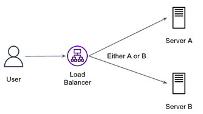

# Networking - HTTP - multichoice questions

Given the following request message, answer the questions below.

```text
GET ../../6.031/www/fa17/classes/24-sockets-networking/ HTTP/1.1
Host: web.mit.edu
User-Agent: Mozilla/5.0 (X11; Ubuntu; Linux x86_64; rv:102.0) Gecko/20100101 Firefox/102.0
Accept: text/html,application/xhtml+xml,application/xml;q=0.9,image/avif,image/webp,*/*;q=0.8
Accept-Language: en-US,en;q=0.5
Accept-Encoding: gzip, deflate, br
Connection: keep-alive
Keep-Alive: 300
Upgrade-Insecure-Requests: 1
Sec-Fetch-Dest: document
```

### Question 1

What is wrong in the request?

1. [ ] You can’t perform a GET request for an HTML pages
2. [ ] An HTML page is requested, but the client doesn’t accept HTML content type.
3. [ ] The Host header must start with http://
4. [ ] The specified resource must be an absolute path (starts with /)


### Question 2

For how long the client persists the TCP connection over which requests and responses will be transferred?

1. [ ] Forever, as she uses keep-alive connection type
2. [ ] For 300 minutes, as specified in “Keep-Alive” header
3. [ ] For 300 seconds, as specified in “Keep-Alive” header
4. [ ] The connection is terminated immediately after a successful response from the server.


### Question 3

The server uses HTTP/2. Choose the correct statement:

1. [ ] The request will fail since the client uses HTTP/1.1
2. [ ] The client and server might use different versions of the HTTP protocol
3. [ ] The request will succeed if the client will emit the HTTP version from the first line
4. [ ] The client should send a `GETVERSION` request to get the server HTTP version

### Question 4

Assume the above request was responded with an HTML page consisting of some text and three images.

Consider the following statement:

**For this page, the client will send one request message and receive four response messages.**

1. [ ] True, this is the expected behavior in HTTP/1.1.
2. [ ] True, as she uses the Keep-Alive header.
3. [ ] False, the text including the three images will be sent on the same response of the original message.
4. [ ] False, the browser will perform other three HTTP requests per image

### Question 5

Assume the server response status code is `408`. Choose the most likely root cause for this response.

1. [ ] The client sent `HEAD` request
2. [ ] The server is overloaded
3. [ ] The request is down
4. [ ] The server already served this resource to this client

### Question 6

Assume the server response status code is 500. How can you advise the client?

1. [ ] Perform the request with `Connection: close` header.
2. [ ] Nothing can help as this code indicates a server side error, the client can try again later.
3. [ ] Check the resource path.
4. [ ] Send the request over HTTPS.


### Question 7

Assume the RES bash variable contains the response status of some request. Which condition will catch all possible failures (both client and server)?

1. [ ] response_code != 200
2. [ ] response_code > 200
3. [ ] response_code < 500
4. [ ] response_code >= 400

### Question 8

**Load balancer** is a piece of software that efficiently distributes incoming network traffic across multiple servers.

By default, a load balancer redirects an incoming requests to a random server:




Sometimes, it is useful to redirect incoming requests to the same server with which a given user was originally redirected to. For example, if a given user was redirected to server B when initially accessed the website, from now on, the load balancer will redirect every request of this user to server B/

This process is called a **Sticky Session**. The load balancer creates an affinity between a client and a specific server for the duration of a session.

How could that be achieved using cookies?

1. [ ] The load balancer caches the information mapping users to the server by client IP.
2. [ ] The load balancer adds a cookie to the server response containing the server ID for which this client is redirected in further requests.
3. [ ] The client sends a cookie to the load balancer containing the server ID for which the client wants to communicate with.
4. [ ] The server uses the `Path` attribute to indicate which paths the client is allowed to access.

### Question 9

Which of the following statements is a misconception of cookies?

1. [ ] Cookies can track users’ browsing activity to serve them relevant ads.
2. [ ] Cookies can help to manage the browsing session of users, i.e. to keep users logged in even when refreshing the page or closing the website tab.
3. [ ] Cookies can personalize websites to improve user experience, such as selected language or accessibility preferences.
4. [ ] Cookies can contain code that may be executed locally on the client machine and cause potential damage.

### Question 10

What is the purpose of a `cookie` header value in an HTTP **GET request**?

1. [ ] This is a value that was returned by a web server to this client during an earlier interaction.
2. [ ] It encodes the format the client prefers to get the response.
3. [ ] It indicates server HTTP protocol version.
4. [ ] It encodes a default setting of the client's browser.


### Question 11

A client sends 2 requests to the server. Here is the response for the first request:

```text
HTTP/1.0 200 OK
Date: Wed, 09 Sep 2020 23:46:21 +0000
Server: Apache/2.2.3 (CentOS)
Last-Modified: Wed, 09 Sep 2020 23:51:41 +0000
ETag:17dc6-a5c-bf716880.
Content-Length: 418
Connection: Close
Content-type: image/html
```

Was the client used the same TCP socket for both requests?

1. [ ] Yes
2. [ ] No
3. [ ] We don't know


