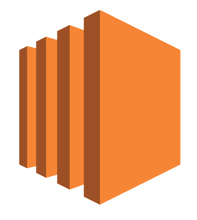
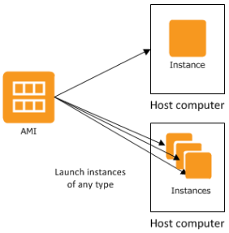
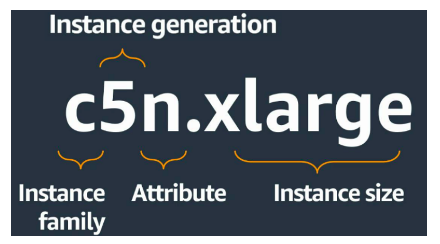

[comment]: # (mdslides presentation.md --include media)

[comment]: # (THEME = white)
[comment]: # (CODE_THEME = base16/zenburn)
[comment]: # (The list of themes is at https://revealjs.com/themes/)
[comment]: # (The list of code themes is at https://highlightjs.org/)

[comment]: # (controls: true)
[comment]: # (keyboard: true)
[comment]: # (markdown: { smartypants: true })
[comment]: # (hash: false)
[comment]: # (respondToHashChanges: false)
[comment]: # (width: 1500)
[comment]: # (height: 1000)

   

DevOps Bootcamp - INT College & UPES University 

# Elastic Cloud Compute (EC2)

[comment]: # (!!!)

### Today's agenda

- Elastic Cloud Compute (EC2) service overview
- Elastic Block Storage (EBS) overview
- AMIs
- EC2 Networking and security

[comment]: # (!!!)

### Elastic Cloud Compute (EC2) overview

- Reliable, secure, and almost infinite compute capability
- Preconfigured templates for your instances, known as Amazon Machine Images (**AMI**s), that package the bits you need for your server (Linux and Windows)
- Various configurations of CPU, memory, storage, and networking capacity for your instances, known as **instance types**
- Persistent storage volumes for your data using Amazon Elastic Block Store (Amazon EBS), known as **Amazon EBS** volumes
- A firewall that enables you to specify the protocols, ports, and source IP ranges that can reach your instances using **security groups**
- Natively integrated with most of the AWS services
- Pay-as-you-go [pricing model](https://aws.amazon.com/ec2/pricing/on-demand/)

[comment]: # (!!!)

### Amazon Machine Images (AMI)

An [Amazon Machine Image (AMI)](https://docs.aws.amazon.com/AWSEC2/latest/UserGuide/AMIs.html) is a supported and maintained image provided by AWS that provides the information required to launch an instance.

- Most common Linux and Windows distro images ready to use
- You can launch an instance from an existing AMI, customize the instance (for example, install software on the instance), and then save this updated configuration as a custom AMI.
- You can purchase AMIs from a third party, including AMIs that come with service contracts from organizations such as Red Hat.

[comment]: # (!!! data-auto-animate)

### Amazon Machine Images (AMI)

- AMIs are categorized as either **backed by Amazon EBS** (your instance data is persistent), or **backed by instance store** (your instance data is lost when the instance is **stopped**).
- There are four sources of AMIs:
  - Published by AWS
  - The AWS Marketplace
  - Generated from Existing Instances
  - [Uploaded Virtual Servers](https://docs.aws.amazon.com/vm-import/latest/userguide/vmimport-image-import.html)

[comment]: # (!!! data-auto-animate)

### Instance types

When you launch an instance, the [instance type](https://docs.aws.amazon.com/AWSEC2/latest/UserGuide/instance-types.html) that you specify determines the hardware of the host computer used for your instance.

- Each instance type offers different compute, memory, and storage capabilities.
- Instances are grouped in an instance family based on these capabilities.
- Remember that your EC2 shares other resources of the host computer, with other AWS customers. If each instance on a host computer tries to use as much of one of these shared resources as possible, each receives an equal share of that resource.
- If the host computer is underused, your instance can consume a **higher** share of that resource while it's available.
- Amazon Web Services offers [previous generation](https://docs.aws.amazon.com/AWSEC2/latest/UserGuide/instance-types.html#previous-gen-instances) instance types for users who have optimized their applications around them, as well as then [current generation](https://docs.aws.amazon.com/AWSEC2/latest/UserGuide/instance-types.html#current-gen-instances) types.

[comment]: # (!!! data-auto-animate)

### Instance types name

Instance types are named based on their family (**c**), generation (**5**), additional capabilities (**n**), and size (**xlarge**).

- Possible families are: General purpose, Compute optimized, Memory optimized, Storage optimized, Accelerated computing
- The following are the additional capabilities indicated by the instance type names:
  - a – AMD processors
  - i – Intel processors
  - d – Instance store volumes
  - n – Network optimization
  - b – Block storage optimization

[comment]: # (!!!  data-auto-animate)

### AMI virtualization types

The [virtualization type](https://docs.aws.amazon.com/AWSEC2/latest/UserGuide/virtualization_types.html) of your instance is determined by the AMI  that you use to launch it.

- Current generation instance types support hardware virtual machine (HVM) only.
- Some previous generation instance types support paravirtual (PV).
- For best performance, AWS recommends that you use an HVM AMI.
- The [Nitro System](http://aws.amazon.com/ec2/nitro/) provides bare metal capabilities that eliminate virtualization overhead and support workloads that require full access to host hardware.

[comment]: # (!!!)

### Networking and storage features

When you select an instance type, this determines the networking and storage features that are available.

- IPv6 is supported on all current generation instance types.
- To maximize the networking and bandwidth performance of your instance type, you can do the following:
  - Launch supported instance types into a cluster [placement group](https://docs.aws.amazon.com/AWSEC2/latest/UserGuide/placement-groups.html).
  - Enable [enhanced networking](https://docs.aws.amazon.com/AWSEC2/latest/UserGuide/enhanced-networking.html).
- To obtain additional, dedicated capacity for Amazon EBS I/O, you can launch some instance types as [EBS–optimized instances](https://docs.aws.amazon.com/AWSEC2/latest/UserGuide/ebs-optimized.html).
- The EBS volume persists independently for the life span of the instance. Three types of volumes:
  - General purpose (SSD)
  - Provisioned IOPS (PIOPS)
  - Magnetic

[comment]: # (!!!)

### Instance purchasing options

Amazon EC2 provides the following purchasing options to enable you to optimize your costs based on your needs:

- **On-Demand Instances** – Pay, by the second, for the instances that you launch.
- **Reserved Instances** – Reduce your Amazon EC2 costs by making a commitment to a consistent instance configuration, including instance type and Region, for a term of 1 or 3 years.
- **Spot Instances** – Request unused EC2 instances, which can reduce your Amazon EC2 costs significantly.
- **Dedicated Hosts** – Pay for a physical host that is fully dedicated to running your instances, and bring your existing per-socket, per-core, or per-VM software licenses to reduce costs.
- **Dedicated Instances** – Pay, by the hour, for instances that run on single-tenant hardware.

[comment]: # (!!! data-auto-animate)

### Status checks for your instances

AWS provide system status checks and instance status checks automatically to all your running instances.

- **System status checks** monitor the AWS systems on which your instance runs. These checks detect underlying problems with your instance that require AWS involvement to repair.
- The following are examples of problems that can cause system status checks to fail:
  - Loss of network connectivity
  - Loss of system power
  - Software issues on the physical host
- **Instance status checks** monitor the software and network configuration of your individual instance. Done by sending an address resolution protocol (ARP) request to the network interface (NIC).

[comment]: # (!!! data-auto-animate)

### Status checks for your instances

- The following are examples of problems that can cause instance status checks to fail:
  - Failed system status checks
  - Incorrect networking or startup configuration
  - Exhausted memory
  - Corrupted file system
  - Incompatible kernel

[comment]: # (!!! data-auto-animate)

### EC2 Security

- A [key pair](https://docs.aws.amazon.com/AWSEC2/latest/UserGuide/ec2-key-pairs.html) is a set of security credentials that you use to prove your identity when connecting to an instance. AWS stores the public key on your instance, and you store the private key.
- A [security group](https://docs.aws.amazon.com/AWSEC2/latest/UserGuide/ec2-security-groups.html) acts as a virtual firewall for your EC2 instances to control incoming and outgoing traffic.
- You can specify one or more security groups. If you don't specify a security group, AWS uses the default security group.
- New and modified rules are automatically applied to all instances that are associated with the security group.
- A security group is **default deny** and **stateful**.

[comment]: # (!!!data-auto-animate)

### EC2 Storage

Amazon EC2 provides you with flexible and easy-to-use data storage options for your instances.

- **Amazon EBS** provides durable, block-level storage volumes that you can attach to a running instance.
- **Amazon EC2 instance store** allows access storage from disks that are **physically attached to the host computer**. [Instance store](https://docs.aws.amazon.com/AWSEC2/latest/UserGuide/InstanceStorage.html) provides temporary block-level storage for instances. The data on an instance store volume persists only during the life of the associated instance; if you stop, or terminate an instance, any data on instance store volumes is lost.
- **Amazon EFS** provides [scalable file storage](https://docs.aws.amazon.com/AWSEC2/latest/UserGuide/AmazonEFS.html) for use with Amazon EC2.

When you launch an instance, the [root device volume](https://docs.aws.amazon.com/AWSEC2/latest/UserGuide/RootDeviceStorage.html) contains the image used to boot the instance (usually it’s an EBS volume). The root volume is mounted automatically.

[comment]: # (!!!data-auto-animate)

### EC2 Storage

The following figure shows the relationship between the different storage options for your instance:

[comment]: # (!!!data-auto-animate)

# Thanks

[comment]: # (!!! data-background-color="aquamarine")

