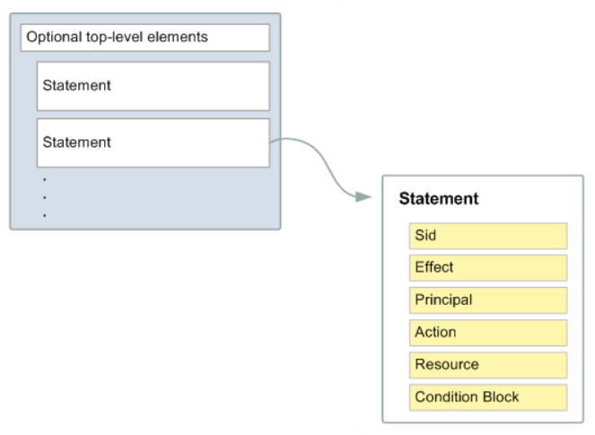
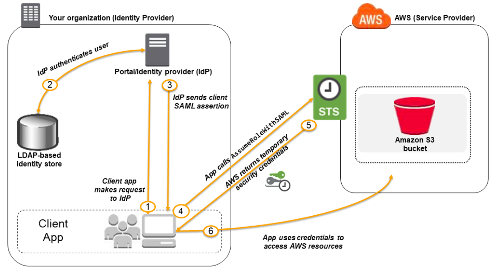

[comment]: # (mdslides presentation.md --include media)

[comment]: # (THEME = white)
[comment]: # (CODE_THEME = base16/zenburn)
[comment]: # (The list of themes is at https://revealjs.com/themes/)
[comment]: # (The list of code themes is at https://highlightjs.org/)

[comment]: # (controls: true)
[comment]: # (keyboard: true)
[comment]: # (markdown: { smartypants: true })
[comment]: # (hash: false)
[comment]: # (respondToHashChanges: false)
[comment]: # (width: 1500)
[comment]: # (height: 1000)

---

<style type="text/css">
  .reveal { 
    font-size: 2.2em;
  }

  .reveal .code-wrapper code {
    white-space: pre;
    font-size: 2em;
    line-height: 1.2em;
  }
</style>
---

DevOps Bootcamp - UPES University

# Identity and Access Management (IAM)

[comment]: # (!!!)

### Today's agenda

- Service overview
- Identities
- Access management using policies
- Identity providers and federation
- Best practice


[comment]: # (!!!)

### Identity and Access Management (IAM) overview

- Identity and Access Management (IAM) is a **global centralized** web service that helps you securely control access to AWS resources.
- IAM uses traditional identity concepts such as **users**, **groups**, and **access control policies** to control who can use your AWS account, what services and resources they can use, and how they can use them.
- Granular enough to limit a single user to perform a single action on a specific resource from a specific IP address during a specific time window.
- Support for identity federation - you can grant access to your AWS account for users from other identity providers, e.g. AD.
- IAM is not an identity store/authorization system for your applications (consider [AWS Cognito](https://docs.aws.amazon.com/cognito/latest/developerguide/what-is-amazon-cognito.html) for this purpose).
- [Eventually Consistent system](https://wikipedia.org/wiki/Eventual_consistency) (changes have to propagate..).
- IAM is offered at **no additional charge**.

[comment]: # (!!!)

### Identities

AWS allow different identities to access and operate on an account, depending on the work that you do in AWS.

- **The root user**: When you create an AWS account, you begin with one sign-in identity that has complete access to all AWS services and resources in the account. This identity is called the AWS account root user.
  Do not use the root user for your everyday tasks. Enable strong MFA (multiple [Yubikeys](https://www.yubico.com/) for core admins).

[comment]: # (||| data-auto-animate)

### Identities

AWS allow different identities to access and operate on an account, depending on the work that you do in AWS.

- An [IAM user](https://docs.aws.amazon.com/IAM/latest/UserGuide/id_users.html) is an identity within your AWS account that has specific permissions for a single person or application.

[comment]: # (||| data-auto-animate)

### Identities

AWS allow different identities to access and operate on an account, depending on the work that you do in AWS.

- An [IAM group](https://docs.aws.amazon.com/IAM/latest/UserGuide/id_groups.html) is an identity that specifies a collection of IAM users. Groups make permissions easier to manage for large sets of users. For example, you could have a group named IAMAdmins and give that group permissions to administer IAM resources.

[comment]: # (||| data-auto-animate)

### Identities

AWS allow different identities to access and operate on an account, depending on the work that you do in AWS.

- An [IAM role](https://docs.aws.amazon.com/IAM/latest/UserGuide/id_roles.html) is an identity within your AWS account that can **be assumed** by anyone who needs it.

[comment]: # (!!! data-auto-animate)

### IAM roles

- Role is similar to an IAM user, but is not associated with a specific person.
- Role is a “mask” that can be put on some identity. Wheneven the identity is assumed the mask, it has a temporary set of permissions.
- IAM roles with temporary credentials are useful in the following situations:
  - **Service role** – A service role is an IAM role that a service assumes to perform actions on your behalf. For example, application runs in EC2 should talk with S3.
  - [Federated user access](https://docs.aws.amazon.com/IAM/latest/UserGuide/id_roles_create_for-idp.html) – To assign permissions to a federated identity, you create a role and define permissions for the role. When a federated identity authenticates, the identity is associated with the role and is granted the permissions that are defined by the role.
  - **Temporary IAM user permissions** – An IAM user or role can assume an IAM role to temporarily take on different permissions for a specific task.
  - **Cross-account access** – You can use an IAM role to allow someone (a trusted principal) in a different account to access resources in your account.

[comment]: # (!!! data-auto-animate)

### Access management

You grant permissions to a identities by creating a **policy**, which is a document that lists the **actions** that a user can perform and the resources those actions can affect.

- A policy is an object in AWS that, when associated with an identity or resource, defines their permissions.
- Identity-based policies are control what actions an identity (users, groups of users, and roles) can perform, on which resources, and under what conditions.
- Resource-based policies are policies you attach to a resource such as an Amazon S3 bucket. These policies grant the specified principal permission To perform specific actions on that resource.

[comment]: # (!!! data-auto-animate)

### Access management


[comment]: # (!!!  data-auto-animate)

### Policy document - JSON structure


- A JSON policy document includes these elements:
  - Optional policy-wide information at the top of the document
  - One or more individual statements

- Each statement includes information about a single permission. If a policy includes multiple statements, AWS applies a logical **OR** across the statements when evaluating them.
  - Version – Specify the version of the policy language that you use.
  - Sid (Optional) – Include an optional statement ID to differentiate between your statements.
  - Effect – Allow or Deny.
  - Principal – Used to specify the identity in resource-based policy.
  - Action – List of actions that the policy allows or denies.
  - Resource – List of resources to which the actions apply.
  - Condition (Optional) – Specify the circumstances under which the policy grants permission.
  

[comment]: # (!!!)

### Policy document - JSON structure



[comment]: # (!!!)

### Amazon Resource Name (ARN)

Amazon Resource Names (ARNs) uniquely identify AWS resources. AWS require an ARN when you need to specify a resource unambiguously across all of AWS, such as in IAM policies, and API calls.

The following are the general formats for ARNs:

```text
arn:partition:service:region:account-id:resource-id
arn:partition:service:region:account-id:resource-type/resource-id
arn:partition:service:region:account-id:resource-type:resource-id
```

[comment]: # (|||)

### Amazon Resource Name (ARN)

```text
arn:partition:service:region:account-id:resource-id
arn:partition:service:region:account-id:resource-type/resource-id
arn:partition:service:region:account-id:resource-type:resource-id
```

**partition** - is a group of AWS Regions (aws, aws-cn, aws-us-gov...)

[comment]: # (|||)

### Amazon Resource Name (ARN)

```text
arn:partition:service:region:account-id:resource-id
arn:partition:service:region:account-id:resource-type/resource-id
arn:partition:service:region:account-id:resource-type:resource-id
```

**service** - is the namespace that identifies the AWS product (S3, ec2, [etc...](https://docs.aws.amazon.com/service-authorization/latest/reference/reference.html))

[comment]: # (|||)

### Amazon Resource Name (ARN)

```text
arn:partition:service:region:account-id:resource-id
arn:partition:service:region:account-id:resource-type/resource-id
arn:partition:service:region:account-id:resource-type:resource-id
```

**region** - is the Region code (us-east-2, [etc...](https://docs.aws.amazon.com/general/latest/gr/rande.html#regional-endpoints))

[comment]: # (|||)

### Amazon Resource Name (ARN)

```text
arn:partition:service:region:account-id:resource-id
arn:partition:service:region:account-id:resource-type/resource-id
arn:partition:service:region:account-id:resource-type:resource-id
```

**account-id** - is the ID of the AWS account that owns the resource without the hyphens

[comment]: # (|||)

### Amazon Resource Name (ARN)

```text
arn:partition:service:region:account-id:resource-id
arn:partition:service:region:account-id:resource-type/resource-id
arn:partition:service:region:account-id:resource-type:resource-id
```

**resource-id** - is the resource identifier or optionally [resource path](https://docs.aws.amazon.com/general/latest/gr/aws-arns-and-namespaces.html#arns-paths)

[comment]: # (!!!)

### Resource-based policies

So far we’ve seen identity-based policies. Sometimes, it is useful to attach a policy directly to the resource that you want to share, instead of grant permissions to specific identity.

- Unlike an identity-based policy, a resource-based policy specifies who (which principal) can access that resource.
- The resource that you want to share must [support](https://docs.aws.amazon.com/IAM/latest/UserGuide/reference_aws-services-that-work-with-iam.html#compute_svcs) resource-based policies.
- Resource-based policies are widely used to **grant cross-account access** to resources, which has an advantage over role-based access. The principal continues to have access to resources in the trusted account at the same time as he has access to the resource in the other account.


[comment]: # (!!!)

### Resource-based policies

1. AccountA gives AccountB full access to BucketA by naming AccountB as a principal in the resource-based policy. As a result, AccountB is authorized to perform any action on BucketA, and the AccountB administrator can delegate access to its users in AccountB.
2. The AccountB root user has all of the permissions that are granted to the account. Therefore, the root user has full access to BucketA.
3. The AccountB administrator does not give access to User1. By default, users do not have any permissions except those that are explicitly granted. Therefore, User1 does not have access to BucketA.
4. The AccountB administrator grants User2 read-only access to BucketA. User2 can view the objects in the bucket. The maximum level of access that AccountB can delegate is the access level that is granted to the account. In this case, the resource-based policy granted full access to AccountB, but User2 is granted only read-only access.


[comment]: # (!!!)

### Permission Boundaries

Permissions boundary is an advanced feature for using a managed policy to set the maximum permissions that an identity-based policy can grant to an IAM entity.

- The boundary set limits the maximum permissions for the user or role.
- An entity's [permissions boundary](https://docs.aws.amazon.com/IAM/latest/UserGuide/access_policies.html#policies_bound) allows it to perform only the actions that are allowed by both its identity-based policies and its permissions boundaries.
- For example, assume that the IAM user named ShirleyRodriguez should be allowed to manage only Amazon S3, Amazon CloudWatch, and Amazon EC2.


[comment]: # (!!!)

### Identity providers and federation


If you already manage user identities outside of AWS, you can use IAM identity providers instead of creating IAM users in your AWS account.

- With an **identity provider (IdP)**, you can manage your user identities outside of AWS and give these external user identities permissions to use AWS resources in your account.
- This is useful if your organization already has its own identity system, such as a corporate user directory.
- Your external users sign in through a well-known IdP, such as Login with Amazon, Facebook, or Google. You can give those external identities permissions to use AWS resources in your account.
- To use an IdP, you create an IAM identity provider entity to establish a trust relationship between your AWS account and the IdP.
- IAM supports IdPs that are compatible with [OpenID Connect (OIDC)](http://openid.net/connect/) or [SAML 2.0 (Security Assertion Markup Language 2.0)](https://wiki.oasis-open.org/security).


[comment]: # (!!!)

### Identity providers and federation




[comment]: # (!!!)

### How IAM works


- First, a [principal](https://docs.aws.amazon.com/IAM/latest/UserGuide/intro-structure.html#intro-structure-principal) must be authenticated (signed in to AWS) using their credentials to send a request to AWS.


[comment]: # (|||)

### How IAM works


- Principal uses AWS by sending an HTTP request. The request includes the following information (a.k.a request context): Actions or operations, Resources, Principal information - policies that are associated with that principal, etc..., Environment data (ip, timezone, etc…), Resource data - Data related to the resource that is being requested

[comment]: # (|||)

### How IAM works


- First, a [principal](https://docs.aws.amazon.com/IAM/latest/UserGuide/intro-structure.html#intro-structure-principal) must be authenticated (signed in to AWS) using their credentials to send a request to AWS.


[comment]: # (|||)

### How IAM works


- The principal must also be authorized (allowed) to complete the request.
- IAM evaluates a principal's permissions at the time the principal makes a request.
- After your request has been authenticated and authorized, AWS approves the actions or operations in your request.
- After AWS approves the operations in your request, they can be performed on the related resources.


[comment]: # (!!!)

### Best Practice

- [Rotate access keys regularly for use cases that require long-term credentials](https://docs.aws.amazon.com/IAM/latest/UserGuide/best-practices.html#rotate-credentials)
- [Require multi-factor authentication (MFA)](https://docs.aws.amazon.com/IAM/latest/UserGuide/best-practices.html#enable-mfa-for-privileged-users)
- [Apply least-privilege permissions](https://docs.aws.amazon.com/IAM/latest/UserGuide/best-practices.html#grant-least-privilege)
- [Get started with AWS managed policies and move toward least-privilege permissions](https://docs.aws.amazon.com/IAM/latest/UserGuide/best-practices.html#bp-use-aws-defined-policies)
- [Use IAM Access Analyzer to generate least-privilege policies based on access activity](https://docs.aws.amazon.com/IAM/latest/UserGuide/best-practices.html#bp-gen-least-privilege-policies)
- [Regularly review and remove unused users, roles, permissions, policies, and credentials](https://docs.aws.amazon.com/IAM/latest/UserGuide/best-practices.html#remove-credentials)
- [Use conditions in IAM policies to further restrict access](https://docs.aws.amazon.com/IAM/latest/UserGuide/best-practices.html#use-policy-conditions)
- [Use permissions boundaries to delegate permissions management within an account](https://docs.aws.amazon.com/IAM/latest/UserGuide/best-practices.html#bp-permissions-boundaries)


[comment]: # (!!!)

# Thanks

[comment]: # (!!! data-background-color="aquamarine")


