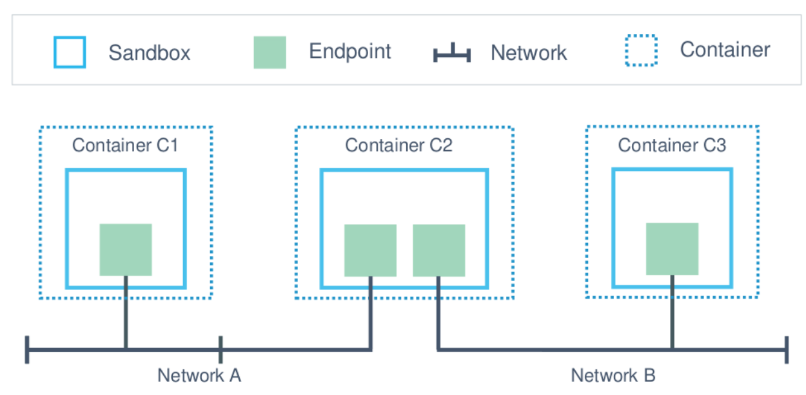
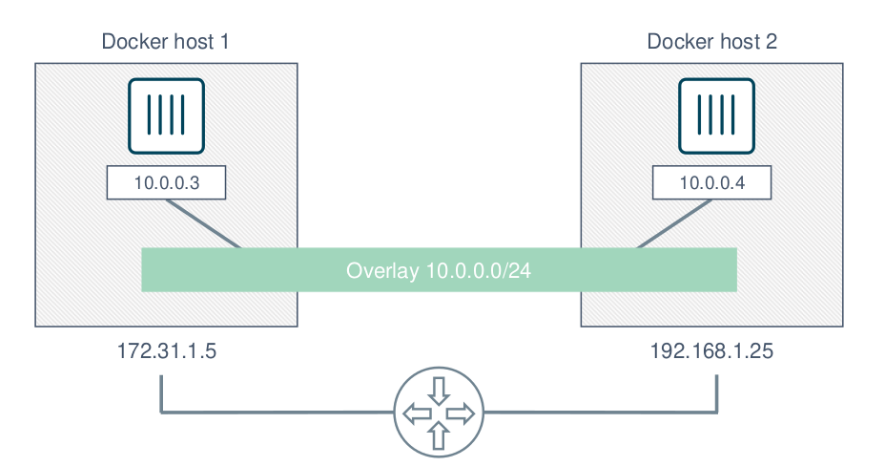
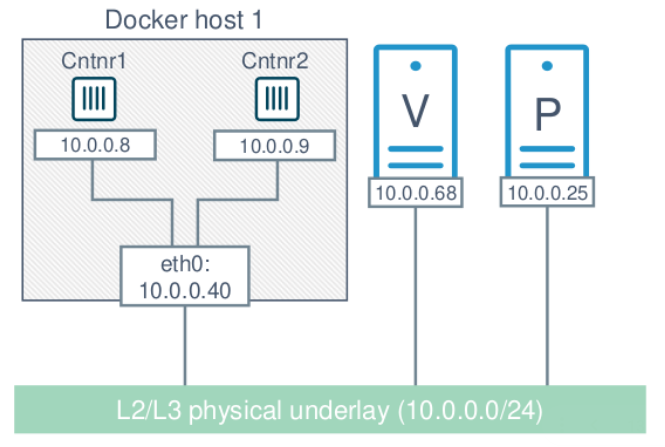

[comment]: # (mdslides presentation.md --include media)

[comment]: # (THEME = white)
[comment]: # (CODE_THEME = base16/zenburn)
[comment]: # (The list of themes is at https://revealjs.com/themes/)
[comment]: # (The list of code themes is at https://highlightjs.org/)

[comment]: # (controls: true)
[comment]: # (keyboard: true)
[comment]: # (markdown: { smartypants: true })
[comment]: # (hash: false)
[comment]: # (respondToHashChanges: false)
[comment]: # (width: 1500)
[comment]: # (height: 1000)

   


DevOps Bootcamp - INT College & UPES University

# Docker networking


Figures by: https://github.com/docker/labs


[comment]: # (!!!)

### Today's agenda

- Container networking background
- Libnetwork and the CNM model
- Bridge networks
- Overlay networks
- MACVLAN networks

[comment]: # (!!!)

## Background - Docker networking

Networking is integral part of applications, but how can isolated container environment connect to the network?


- Docker abstracts networking stack for containers including all the traditional components we know - network interfaces, routing tables, IP addresses etc.
- Make communication between containers as simple as communicate between two bare metal machines.
- Support single-host and multi-host networking
- Create a pluggable network stack
- Make networks secure and scalable

[comment]: # (!!!)

## Container Network Model (CNM)


[comment]: # (!!! data-auto-animate)

## Container Network Model (CNM)



[comment]: # (!!! data-auto-animate)

## Libnetwork - the Docker's native implementation of the CNM

[Libnetwork](https://github.com/moby/libnetwork) is a library written by Docker's team, that implements the CNM model.

- It contains everything needed to create and manage container networks
- Pluggable model
- Multi-platform, written in Go, open source
- Drivers are used to implement different networking technologies
- Built-in drivers are called local drivers, and include: `bridge`, `host`, `overlay`, `MACVLAN`


[comment]: # (!!! data-auto-animate)

## Libnetwork - the Docker's native implementation of the CNM

```bash [1|10|12]
$ docker info
 Storage Driver: overlay2
  Backing Filesystem: extfs
  Supports d_type: true
  Native Overlay Diff: true
  userxattr: false
 Logging Driver: json-file
 Cgroup Driver: cgroupfs
 Cgroup Version: 1
 Plugins:
  Volume: local
  Network: bridge host ipvlan macvlan null overlay
```

[comment]: # (!!!)

## Single-host networking - The bridge driver

Docker **bridge** networking enables containers on a single host to communicate seamlessly.

- The bridge driver creates a bridge (virtual switch) on a single Docker host
- Containers get plumbed into this bridge
- All containers on this bridge can communicate
- The bridge is a private network restricted to a single Docker host - Containers on different bridge networks cannot communicate


[comment]: # (!!!)

## The bridge driver

- Docker is shipped with a default bridge network. If you don't specify container network, your container is connected to this bridge.
- The bridge network interface is called **docker0**


[comment]: # (!!!)

You can create your own bridge network

Let's see it in action...

[comment]: # (!!!)

## Multi-host networking - The overlay driver

The **overlay** driver enables simple and secure multi-host networking

- All containers on the overlay network can communicate, as if they are sharing the same machine.


[comment]: # (!!! data-auto-animate)

## Multi-host networking - The overlay driver


- The overlay driver uses VXLAN technology to build the network
- Containers are sharing the same IP subnet mask
- The communication over the public network is secured



[comment]: # (!!! data-auto-animate)


## Connecting container to an existing network - The MACVLAN driver

MACVLAN is a networking driver in Docker that allows containers to be connected to virtual and physical machines on existing networks and VLANs.

- Each container gets its own MAC and IP on the underlay network.
- Containers are visible on the physical underlay network.
- Gives containers direct access to the underlay network without port mapping and without a Linux bridge.

[comment]: # (!!! data-auto-animate)


## Connecting container to an existing network - The MACVLAN driver



[comment]: # (!!! data-auto-animate)


# Thanks

[comment]: # (!!! data-background-color="aquamarine")
