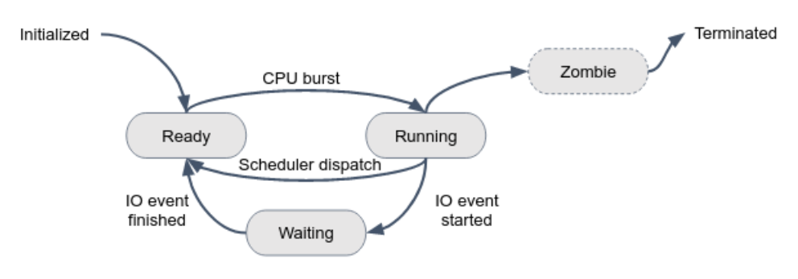

[comment]: # (mdslides presentation.md --include media)

[comment]: # (THEME = white)
[comment]: # (CODE_THEME = base16/zenburn)
[comment]: # (The list of themes is at https://revealjs.com/themes/)
[comment]: # (The list of code themes is at https://highlightjs.org/)

[comment]: # (controls: true)
[comment]: # (keyboard: true)
[comment]: # (markdown: { smartypants: true })
[comment]: # (hash: false)
[comment]: # (respondToHashChanges: false)
[comment]: # (width: 1500)
[comment]: # (height: 1000)

DevOps Bootcamp - UPES University

# Linux Processes

[comment]: # (!!!)

### Today’s agenda

- Linux processes introduced
- Process state
- Scheduling algorithms
- `/proc` directory - you’ll find there everything about your running processes!

[comment]: # (!!!)

"On a UNIX system, everything is a **file**; if something is not a file, it is a **process**."

[comment]: # (!!!)

## Process definition

Processes are an instance of an executing program.

[comment]: # (!!!)

## Processes examples

- If you are viewing this text in a web browser, your browser is running as a process.

[comment]: # (!!! data-auto-animate)

## Processes examples

- If you are viewing this text in a web browser, your browser is running as a process.
- If you are typing some bash commands, each one of them is running as a process.

[comment]: # (!!! data-auto-animate)

## Linux processes

The lifecycle of every process can be described by the below diagram

[comment]: # (!!!)

## Process Resources

Here are the components that constitute a process:

 

- **Execution Context**: Physical memory, no other process can access it.
- **I/O Context**: Open File Descriptors, Memory Mapped Files, Filesystem Context(work dir, etc..)
- **Environment Variables**
- **Heritage Information**: PID, parent process, children processes
- **Credentials**: owning user and group
- **Resource Statistics and Limits**: CPU and RAM utilizations

 

Each running process on the system is represented as a subdirectory in the `/proc` directory, with the name of the directory corresponding to the process ID (PID) of the process.

[comment]: # (!!!)

## Process Resources

[comment]: # (!!!)

# Thanks
[comment]: # (!!! data-background-color="aquamarine")
